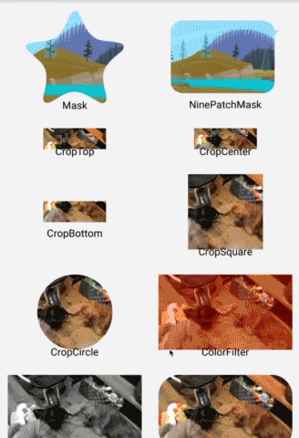

# Xamarin binding for glide-transformations

Glide Transformations
======================
An Android transformation library providing a variety of image transformations for [Glide](https://github.com/bumptech/glide).

Please feel free to use this.

# Demo

### Original Image


### Transformations


# How do I use it?

## Step 1

#### Gradle
```powershell
PM Install-Package Xamarin.Android.Glide.Transformations -Version 4.3.0
# If you want to use the GPU Filters
PM Install-Package Xamarin.Android.Glide.Transformations.Gpu -Version 2.1.0
```

## Step 2

Set Glide Transform.

```csharp
Glide.With(this).Load(Resource.Drawable.demo)
  .Apply(RequestOptions.BitmapTransform(new BlurTransformation(25, 3)))
  .Into(imageView)
```

## Advanced Step 3

You can set a multiple transformations.

```csharp
val multi = new MultiTransformation<Bitmap>(
  new BlurTransformation(25),
  new RoundedCornersTransformation(128, 0, CornerType.Bottom))))
Glide.With(this).Load(Resource.Drawable.demo)
  .Apply(RequestOptions.BitmapTransform(multi))
  .Into(imageView))
```

## Transformations

### Crop
- `CropTransformation`
- `CropCircleTransformation`
- `CropCircleWithBorderTransformation`
- `CropSquareTransformation`
- `RoundedCornersTransformation`

### Color
- `ColorFilterTransformation`
- `GrayscaleTransformation`

### Blur
- `BlurTransformation`

### Mask
- `MaskTransformation`

### GPU Filter (use [GPUImage](https://github.com/CyberAgent/android-gpuimage))
**Will require add dependencies for GPUImage.**  

- `ToonFilterTransformation`
- `SepiaFilterTransformation`
- `ContrastFilterTransformation`
- `InvertFilterTransformation`
- `PixelationFilterTransformation`
- `SketchFilterTransformation`
- `SwirlFilterTransformation`
- `BrightnessFilterTransformation`
- `KuwaharaFilterTransformation`
- `VignetteFilterTransformation`

License
-------

    Copyright (C) 2020 Wasabeef

    Licensed under the Apache License, Version 2.0 (the "License");
    you may not use this file except in compliance with the License.
    You may obtain a copy of the License at

       http://www.apache.org/licenses/LICENSE-2.0

    Unless required by applicable law or agreed to in writing, software
    distributed under the License is distributed on an "AS IS" BASIS,
    WITHOUT WARRANTIES OR CONDITIONS OF ANY KIND, either express or implied.
    See the License for the specific language governing permissions and
    limitations under the License.
